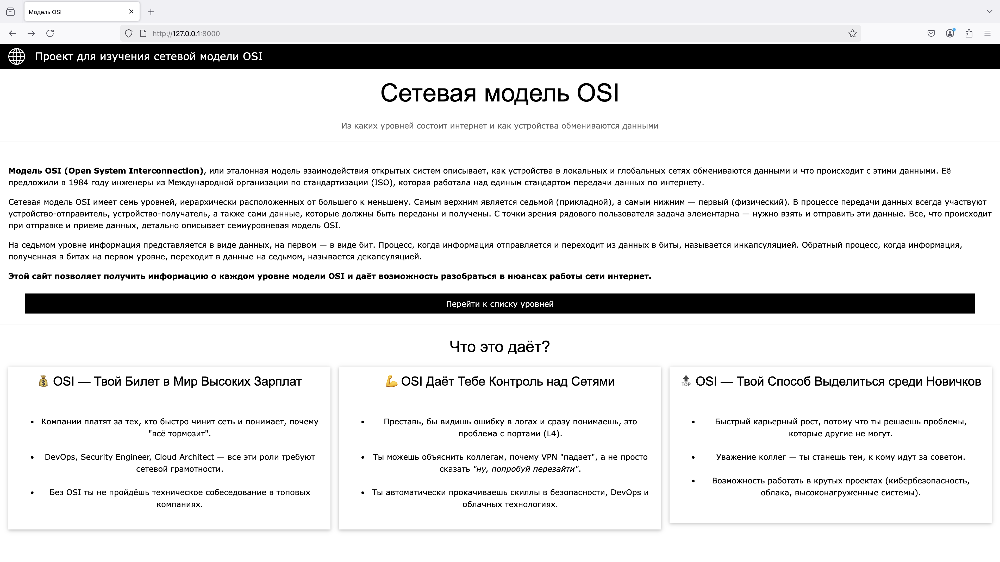

# Project with webapp for osi model studying
This repository contains code of MIPT python course project. It will help you learn more about the OSI model.

## How to run
### First, you need to clone the repository:
```
git clone https://github.com/barannikovav/osi_model_webapp
```

### Navigate into the clonned directory:
```
cd osi_model_webapp
```

### Create virtual environment:
```
python -m venv .env
```

### Activate virtual environment:
```
.env\Scripts\activate
```

### Install dependencies:
```
pip install -r requirements.txt
```

### Perform migration of the database
```
python manage.py migrate
```

### Load initial data from fixture into the database
```
python manage.py loaddata osi_layers.json
```

### Run server (for example, on localhost):
```
python manage.py runserver --insecure
```

### Navigate to browser and type localhost address (http://127.0.0.1:8000):



## Check code with pylint
### One can run pylint to check code quality:
```
pylint --load-plugins=pylint_django --django-settings-module=osi_model.settings osi_model/*.py layers/*.py